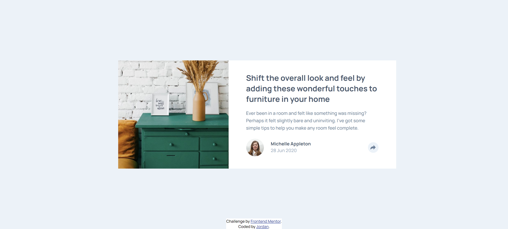
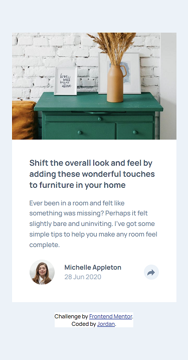

# Frontend Mentor - Article preview component solution

This is a solution to the [Article preview component challenge on Frontend Mentor](https://www.frontendmentor.io/challenges/article-preview-component-dYBN_pYFT). Frontend Mentor challenges help you improve your coding skills by building realistic projects. 

Frontend Mentor challenges provide a jpg design of a website to code. They include a style guide (which includes the hsl values of the text and background colours, the font and font size, and the widths for mobile and desktop designs) as well as the text on page. 
I then code the site by myself from scratch. 

Difficulty: Level 1 (Newbie)

## Overview

### The challenge

Users should be able to:

- View the optimal layout for the component depending on their device's screen size (only desktop and mobile size's have been coded)
- See the social media share links when they click the share icon

### Links

- Live Site URL: (https://jordansgit.github.io/article-preview-component/)

### Built with
- HTML5 
- CSS 
- JavaScript 

### Screenshot

Desktop 

Mobile 

